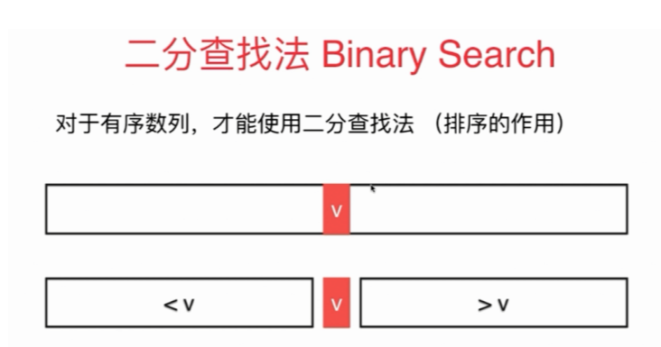
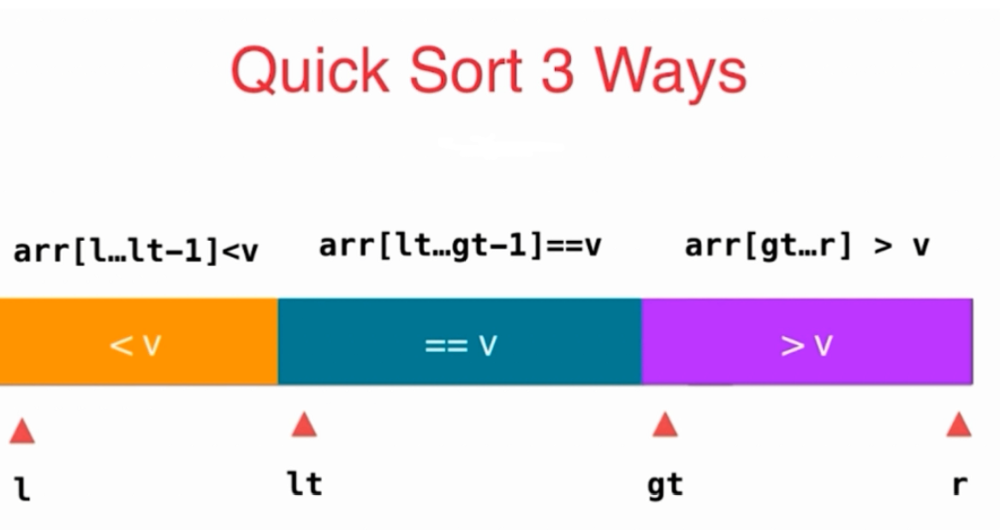
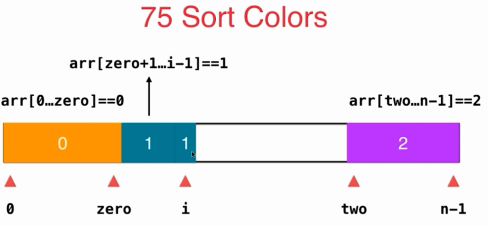
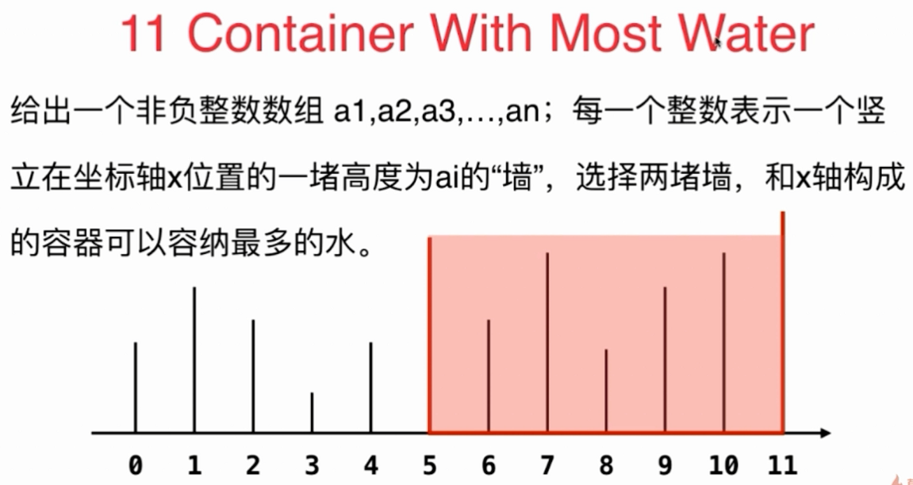
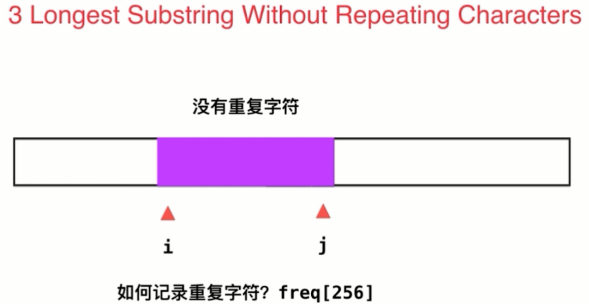

<!-- GFM-TOC -->
* [常见的数组问题](#常见的数组问题)
	* [二分查找法](#二分查找法)
	* [简单的面试问题](#简单的面试问题)
	    * [283 Move Zeros](https://leetcode.com/problems/move-zeroes/description/)
	    * [27 Remove Element](https://leetcode.com/problems/remove-element/description/)
	    * [26 Remove Duplicates from Sorted Array](https://leetcode.com/problems/remove-duplicates-from-sorted-array/description/)
        * [80 Remove Duplicates from Sorted Array II](https://leetcode.com/problems/remove-duplicates-from-sorted-array-ii/description/)
    * [排序算法思路的应用](#排序算法思路的应用) 
        * [75 Sort Colors](https://leetcode.com/problems/sort-colors/description/)
        * [88 Merge Sorted Array](https://leetcode.com/problems/merge-sorted-array/description/)
        * [215 Kth Largest Element in an Array](https://leetcode.com/problems/kth-largest-element-in-an-array/description/)
    * [双索引技术](#双索引技术)
        * [对撞指针](#对撞指针)               
            * [167 Two Sum II - Input array is sorted](https://leetcode.com/problems/two-sum-ii-input-array-is-sorted/description/)
            * [125 Valid Palindrome](https://leetcode.com/problems/valid-palindrome/description/)
            * [344 Reverse String](https://leetcode.com/problems/reverse-string/description/)
            * [11 Container With Most Water](https://leetcode.com/problems/container-with-most-water/description/)
        * [滑动窗口](#滑动窗口)
            * [209 Minimum Size Subarray Sum](https://leetcode.com/problems/minimum-size-subarray-sum/description/)
            * [3 Longest Substring Without Repeating Characters](https://leetcode.com/problems/longest-substring-without-repeating-characters/description/)
            * [438 Find All Anagrams in a String](https://leetcode.com/problems/find-all-anagrams-in-a-string/description/)
            * [76 Minimum Window Substring](https://leetcode.com/problems/minimum-window-substring/description)
<!-- GFM-TOC -->

# 常见的数组问题

## 二分查找法

二分查找法在1946年提出。
第一个没有bug的二分查找在1962才出现。

<div align="center"> </div>

```java
public int binarySearch(Comparable[] arr,Comparable target){
        int l=0,r=arr.length-1; //在区间 [l,r]中查找target元素
        while(l<=r){ //当 l==r时，区间[l,r]仍然是有效的
            int mid=(r-l)/2+l;
            int cmp=arr[mid].compareTo(target);
            if(cmp==0){
                return mid;
            }else if(cmp>0){
                r=mid-1; //target在[l,mid-1]中
            }else{
                l=mid+1; //target在[mid+1,r]中
            }
        }
        return -1;
    }
```
二分查找的另一种写法:
```java
 public int binarySearch2(Comparable[] arr,Comparable target){
        int l=0,r=arr.length; //在区间 [l,r)中查找target元素
        while(l<r){ //当 l==r时，区间[l,r)是无效的
            int mid=(r-l)/2+l;
            int cmp=arr[mid].compareTo(target);
            if(cmp==0){
                return mid;
            }else if(cmp>0){
                r=mid; //target在[l,mid)中
            }else{
                l=mid+1; //target在[mid+1,r)中
            }
        }
        return -1;
    }
```
可以看到这两种写法只是所查找的区间不同。

## 简单的面试问题
[283 Move Zeros](https://leetcode.com/problems/move-zeroes/description/)

* 问题描述：

给定一个数组nums,写一个函数，将数组中所有的0挪到数组的末尾，而维持其他所有非0元素的相对位置。

* 举例：

nums[0,1,0,3,12]，函数运行后结果为[1,3,12,0,0]

* 思路：

思路一：

* 1、准备一个集合，用于存储该数组中的非0元素，遍历数组中元素，遇到非0元素，就放入集合中
* 2、对该数组重新赋值，前面的非0元素都是从集合中取出，后面的元素都是0
```java
//时间复杂度 O(n)
//空间复杂度 O(n)
    public void moveZeroes(int[] nums) {
        List<Integer> list=new ArrayList<Integer>();
        for(int num:nums){
            if(num!=0){
                list.add(num);
            }
        }
        for(int i=0;i<list.size();i++){
            nums[i]=list.get(i);
        }
        for(int j=list.size();j<nums.length;j++){
            nums[j]=0;
        }
    }
```

思路二：

* 1、引入另外一个指针k,用于指向数组中非0元素（原有一个遍历数组的指针i），很显然k <= nums.length-1
* 2、则nums的前k个都是非0元素了，剩下的元素就是0元素
```java
//时间复杂度：O(n)
//空间复杂度：O(1)
    public void moveZeroes(int[] nums) {
        int k=0;//[0,k)都是非0元素
        for(int num:nums){
            if(num!=0){
                nums[k++]=num;
            }
        }
        for(int i=k;i<nums.length;i++){
            nums[i]=0;
        }
    }
```

思路三：

* 1、引入另外一个指针k,用于指向数组中非0元素（原有一个遍历数组的指针i），很显然k <= nums.length-1
* 2、[0,k)中元素是非0元素，i指向非0元素，就与k指向的元素交换，这样保证元素的相对顺序
```java
//时间复杂度：O(n)
//空间复杂度：O(1)
    public void moveZeroes(int[] nums) {
        int k=0;//[0,k)都是非0元素
        for(int i=0;i<nums.length;i++){
            /*if(nums[i]!=0){
                swap(nums,k++,i);
            }*/
			//优化
			if(i!=k){
                swap(nums,k++,i);
            }else{
                k++;
            }
        }
    }

    public void swap(int[] nums,int i,int j){
        int tmp=nums[i];
        nums[i]=nums[j];
        nums[j]=tmp;
    }
```

[27 Remove Element](https://leetcode.com/problems/remove-element/description/)

* 问题描述：

给定一个数组nums和一个数值val,将数组中所有等于val的元素删除，并返回剩余元素的个数。

* 举例：

nums=[3,2,2,3],val=3;

返回2，且nums中前两个元素是2

* 思路：

思路一：

* 1、准备一个指针k，指向不是val的元素,保证 [0,k)都没有val元素

* 2、[0,k)就是nums数组的前k个非val的元素，直接返回k值，就可以了

```java
public int removeElement(int[] nums, int val) {
        int k=0;
        for(int num:nums){
            if(num!=val){
                nums[k++]=num;
            }
        }
        return k;
    }
```

思路二：

* 遍历数组，若和val相等，则用最后一项代替这一项，并判断代替后的值是不是和val相等。

```java
public int removeElement(int[] nums, int val) {
        int last=0;
        for(int i=0;i<nums.length-last;i++){
            if(nums[i]==val){
                //元素值与目标值相等，就用最后一项元素代替该元素，再从该元素进行比较
                last++;
                nums[i]=nums[nums.length-last];
                //将最后一项赋值给该元素
                i--;//再比较替换后的元素，再判断是否等于val
            }
        }
        return nums.length-last;
    }
```

[26 Remove Duplicates from Sorted Array](https://leetcode.com/problems/remove-duplicates-from-sorted-array/description/)

* 问题描述：

给定一个有序数组，对数组中的元素去重，使得原数组中每个元素只有一个。返回去重后数组的长度值。

* 举例：

nums=[1,2,2];

返回2，且nums中前两个元素为1和2

* 思路：

* 1、准备一个指针k,[0,k]是没有重复元素

* 2、这是一个有序数组，遍历数组，当nums[i]!=nums[k]就说明遇到另外一个值不相同的元素，将该元素加入[0，k]间中

```java
public int removeDuplicates(int[] nums) {
        if(nums.length==0){
            return 0;
        }
        int k=0;
        for(int i=0;i<nums.length;i++){
            if(nums[i]!=nums[k]){
                //nums[i]是值不同的元素，且i>=k，此时[0,k]存储是不同元素
                k++;
                nums[k]=nums[i];
            }
        }
        return k+1;
    }
```

[80 Remove Duplicates from Sorted Array II](https://leetcode.com/problems/remove-duplicates-from-sorted-array-ii/description/)

* 问题描述：

给定一个有序数组，对数组中的元素去重，使得原数组中每个元素最多保留2个。返回去重后数组的长度值。

* 举例：

nums=[1，1，1,2,2，3];

返回5，且nums中前5个元素为1,1,2,2,3

* 思路：
```java
    public int removeDuplicates(int[] nums) {
        if (nums.length<= 2){
            return nums.length;
        }

        int k = 1;
        //k=1时，前两个元素必然在数组中
        int cnt = 1;
        for(int i=1;i < nums.length;i++) {
            if (nums[i] != nums[i-1]) {
                //相邻元素不相等,元素个数为1
                cnt = 1;
                nums[k++] = nums[i];
            } else {
                //存在相邻元素
                if (cnt < 2) {
                    //cnt<2说明值已经进来1个元素，此时再加1个元素
                    nums[k++] = nums[i];
                    cnt++;
                }
            }
        }
        return k;
    }
```
* 扩展：
```java
 /**
     * 拓展：
     * 给定一个有序数组，对数组中的元素去重，使得原数组中每个元素最多保留n个。返回去重后数组的长度值。
     */
    public int removeDuplicates(int[] nums,int n) {
        if (nums.length<= n){
            return nums.length;
        }

        int k = 1;
        //k=1时，前两个元素必然在数组中
        int cnt = 1;
        for(int i=1;i < nums.length;i++) {
            if (nums[i] != nums[i-1]) {
                //相邻元素不相等,元素个数为1
                cnt = 1;
                nums[k++] = nums[i];
            } else {
                //存在相邻元素
                if (cnt < n) {
                    //cnt<2说明值已经进来1个元素，此时再加1个元素
                    nums[k++] = nums[i];
                    cnt++;
                }
            }
        }
        return k;
    }
```

## 排序算法思路的应用
[75 Sort Colors](https://leetcode.com/problems/sort-colors/description/)

* 问题描述：

给定一个有n个元素的数组，数组中元素的取值只有0,1,2三种可能。
为这个数组排序。

* 解题：

1、明确问题

是否可以使用任何一种排序算法，但是没有使用题目中给出的特殊条件，所以不建议使用排序算法

2、思路一：

分别统计0,1,2元素个数，然后再对数组重新赋值

```java
public void sortColors(int[] nums) {
    int[] count=new int[3];
    //存放0,1,2元素的频率
    for(int i=0;i<nums.length;i++){
        count[nums[i]]++;
    }
    int index=0;
    for(int i=0;i<count[0];i++){
        nums[index++]=0;
    }
    for(int i=0;i<count[1];i++){
        nums[index++]=1;
    }
    for(int i=0;i<count[2];i++){
        nums[index++]=2;
    }
}
```
时间复杂度：O(n)

空间复杂度：O(k),k是nums元素的最大值

3、思路二：借鉴三路快速排序
<div align="center"> </div>

<div align="center"> </div>
zero指针指向0元素,two指针指向2元素，i是遍历数组的指针,
这里有nums[0..zero]==0,nums[zero+1..i+1]==1,nums[two..n-1]==2:

* i指向值为0的元素，swap(i,zero+1) ,交换后，i位置元素是1(nums[zero+1..i+1]==1)，不需要处理，i直接+1
* i指向值为1的元素，不需要处理直接+1
* i指向值为2的元素，swap(i,two-1),交换后，two-1位置元素就是2

```java

public void sortColors(int[] nums){
    int zero=-1;
    //nums[0,zero]==0,开始并没有元素，所以取zero=-1,[0,-1]显然不成立
    int two=nums.length;
    //nums[two,n-1]==2,开始并没有元素，所以取two=n,[n,n-1]显然不成立
    for(int i=0;i<two;){
        if(nums[i]==0){
            zero++;
            swap(nums,zero,i);
            i++;
        }else if(nums[i]==2){
            two--;
            swap(nums,two,i);
        }else{
            i++;
        }
    }
}

public void swap(int[] nums,int i,int j){
    int tmp=nums[i];
    nums[i]=nums[j];
    nums[j]=tmp;
}
```

[88 Merge Sorted Array](https://leetcode.com/problems/merge-sorted-array/description/)

```java
//思路：采用合并排序的思路,这里要想空间复杂度为O（1）,则将两个数组中元素从后向前合并.
public void merge(int[] nums1, int m, int[] nums2, int n) {
    //从后向前合并
    int index=m+n-1;
    int i=m-1;
    int j=n-1;
    while(i>=0 && j>=0){
        if(nums1[i]>nums2[j]){
            nums1[index--]=nums1[i--];
        }else{
            nums1[index--]=nums2[j--];
        }
    }
    //nums2任然有剩余元素，且是最小的那部分元素，将这些元素直接复制到num1的前面
    while(j>=0){
        nums1[index--]=nums2[j--];
    }
}
```

[215 Kth Largest Element in an Array](https://leetcode.com/problems/kth-largest-element-in-an-array/description/)
```java
//根据快速排序中partion划分，
//这里找的是第k大的元素，言下之意，就是要找到第(nums.length-k+1)小的元素
public int findKthLargest(int[] nums, int k) {
	int low=0;
	int high=nums.length-1;
	k=nums.length-k;
	while(low<high){
		int m=partition(nums,low,high);
		//m坐标元素的左边都小于 nums[m],右边都大于元素nums[i]
		if(m==k){
			break;
		}else if(m<k){ //说明
			low=m+1;
		}else if(m>k){
			high=m-1;
		}
	}
	return nums[k];
}

//在[l,r]中已nums[0]为pivot进行划分
public int partition(int[] nums,int l,int r){
	int pivot=nums[l];
	while(l<r){
		//从右向左遍历，找出第一个<pivot的元素
		while(l<r && nums[r]>=pivot){
			r--;
		}
		nums[l]=nums[r];
		//从右向左遍历，找出第一个>pivot的元素
		while(l<r && nums[l]<=pivot){
			l++;
		}
		nums[r]=nums[l];
	}
	nums[l]=pivot;
	return l;
}
```


## 双索引技术
### 对撞指针
[167 Two Sum II - Input array is sorted](https://leetcode.com/problems/two-sum-ii-input-array-is-sorted/description/)

* 问题描述：

给定一个有序整型数组和一个整数target，在其中去找两个元素，使其和为target.
返回这两个数的索引。

* 解题：

1、明确问题

**如果没有解如何处理**？ 题目保证有解

**如果有多个个如何处理**？ 返回任意一组即可

**索引是从0开始还是从1开始**？ 索引从1开始

2、思路一：

数组有序，首先想到二分查找，对于nums[i]，如果数组中存在两个元素和为target，
则必然在nums[i+1...n-1]中存在元素target-nums[i]。

```java
public int[] twoSum(int[] numbers, int target) {
    for(int i=0;i<numbers.length;i++){
        int index=binarySearch(numbers,target-numbers[i],i+1,numbers.length-1);
        if(index!=-1){
            //说明[i+1...n-1]存在元素target-numbers[i]
            return new int[]{i+1,index+1};
        }
    }
    return null;
}

public int binarySearch(int[] numbers,int target,int l,int r){
    while(l<=r){
        int mid=(r-l)/2+l;
        if(numbers[mid]==target){
            return mid;
        }else if(numbers[mid]<target){
            l=mid+1;
        }else{
            r=mid-1;
        }
    }
    return -1;
}
```
时间复杂度 O(nlogn)

空间复杂度 O(1)

3、思路二：

引入两个指针 i,j，分别指向该有序数组的头部和尾部：

当numbers[i]+numbers[j]==target时, i、j就是所求的解

当numbers[i]+numbers[j]<target时,说明值过小，要加大值，i加1

当numbers[i]+numbers[j]==target时,说明值过大，要减小值，j减1

```java
public int[] twoSum(int[] numbers, int target) {
        int i=0;
        int j=numbers.length-1;
        while(i<j){
            //i和j是不能相等的，因为反返回两个不同下标
            int sum=numbers[i]+numbers[j];
            if(sum==target){
                return new int[]{i+1,j+1};
            }else if(sum<target){
                i++;
            }else{
                j--;
            }
        }
        return null;
    }
```
时间复杂度：O(n)

空间复杂度：O(1)
    
[125 Valid Palindrome](https://leetcode.com/problems/valid-palindrome/description/)

```java
//算法思路：对撞指针。只不过要注意遇到不是字母或者数字的字符要跳过，字符之间的比较是忽略大小写的
public boolean isPalindrome(String s) {
    int i=0;
    int j=s.length()-1;
    while(i<j){
        char c1=s.charAt(i);
        char c2=s.charAt(j);
        if(!isNumber(c1) && !isAlpha(c1)){
            i++;
            continue;
        }
        if(!isNumber(c2) && !isAlpha(c2)){
            j--;
            continue;
        }
        if(!isEqual(c1,c2)){
            return false;
        }
        i++;
        j--;
    }
    return true;
}

//比较两个字符是否相等,如果是字母，就忽略大小写
public boolean isEqual(char c1,char c2){
    if(c1==c2){
        return true;
    }else{
        if((isAlpha(c1) && isAlpha(c2)) && Math.abs(c1-c2)==32){
            return true;
        }
    }
    return false;
}

public boolean isNumber(char c){
    if(c>='0' && c<='9'){
        return true;
    }
    return false;
}

public boolean isAlpha(char c){
    if((c>='A' && c<='Z') || (c>='a' && c<='z')){
        return true;
    }
    return false;
}
```
时间复杂度：O(n)

空间复杂度：O(1)

[344 Reverse String](https://leetcode.com/problems/reverse-string/description/)

```java
public String reverseString(String s) {
    int i=0;
    int j=s.length()-1;
    char[] chs=s.toCharArray();
    while(i<j){
        char tmp=chs[i];
        chs[i]=chs[j];
        chs[j]=tmp;
        i++;
        j--;
    }
    return new String(chs);
}
```
时间复杂度：O(n)

空间复杂度：O(n)

[11 Container With Most Water](https://leetcode.com/problems/container-with-most-water/description/)

<div align="center"> </div>

* 解题：

解法一：
```java
//时间复杂度：O(n^2)
//空间复杂度：O(1)
public int maxArea1(int[] height) {
    int mostWater=0;
    for(int i=0;i<height.length;i++){
        for(int j=i+1;j<height.length;j++){
            int h=Math.min(height[i],height[j]);
            if((j-i)*h>mostWater){
                mostWater=(j-i)*h;
            }
        }
    }
    return mostWater;
}
```
解法二：
```java
/**
 *  对撞指针
 *  假设有左指针和右指针，且左指针指向的值小于右指针的值。
 *  假如我们将右指针左移，则右指针左移后的值和左指针指向的值相比有三种情况：
 *  （1）右指针指向的值大于左指针：这种情况下，容器的高取决于左指针，但是底变短了，所以容器盛水量一定变小
 *  （2）右指针指向的值等于左指针：这种情况下，容器的高取决于左指针，但是底变短了，所以容器盛水量一定变小
 *  （3）右指针指向的值小于左指针：这种情况下，容器的高取决于右指针，但是右指针小于左指针，且底也变短了，所以容量盛水量一定变小了
 *  反之，情况类似。
 *  综上所述，容器高度较大的一侧的移动只会造成容器盛水量减小。
 *  所以应当移动高度较小一侧的指针，并继续遍历，直至两指针相遇。
 */
//时间复杂度：O(n)
//空间复杂度：O(1)
public int maxArea(int[] height) {
    int i=0;
    int j=height.length-1;
    int mostWater=0;
    while(i<j){
        int h=Math.min(height[i],height[j]);
        if((j-i)*h>mostWater){
            mostWater=(j-i)*h;
        }
        if(height[i]<height[j]){
            i++;
        }else{
            j--;
        }
    }
    return mostWater;
}
```

### 滑动窗口
[209 Minimum Size Subarray Sum](https://leetcode.com/problems/minimum-size-subarray-sum/description/)

* 问题描述

给定一个整型数组和一个数字s,找到数组中最短的一个连续
子数组，使得连续子数组的数字和sum>=s,返回这个最短的连续子数组的长度值

* 示例：

给定数组[2,3,1,2,4,3],s=7

答案为[4,3],返回2

* 解题：

1、确定问题：

**什么叫子数组**？看子数组是否要求连续，这里是连续的

**如果没有解如何处理**？返回0

2、思路：

l=0,r=-1(一开始不包含任何元素，所以取l=0,r=-1),
滑动窗口[l,r] ,sum是[l...r]的和：

当sum<s时，此时 r+1，拓展该窗口,sum+=nums[r+1]

其他情况，缩小该窗口，sum-=nums[l],l++

```java
public int minSubArrayLen(int s, int[] nums) {
    int n=nums.length;
    int l=0,r=-1;
    //[l,r]为滑动窗口，开始时不包含任何元素
    int sum=0;
    //记录滑动窗口中元素和
    int ret=n+1;
    //ret记录求解的长度
    while(l<n){
        if(r+1<n && sum<s){
            r++;
            sum+=nums[r];
        }else{
            sum-=nums[l];
            l++;
        }
        if(sum>=s){
            ret=Math.min(ret,(r-l+1));
        }
    }
    if(ret==n+1){
        //表示没有找到结果，使得 sum>=s
        ret=0;
    }
    return ret;
}
```
时间复杂度：O(n)

空间复杂度：O(1)

[3 Longest Substring Without Repeating Characters](https://leetcode.com/problems/longest-substring-without-repeating-characters/description/)

* 问题描述：

在一个字符串中寻找没有重复字母的最长子串

* 示例：

如"abcabcbb",则结果为"abc"

如"bbbbb",则结果为"b"

如"pwwkew",则结果为"wke"

* 解答：

1、明确问题

**字符集**？**只有字母**？**数字和字母**？**ACSII**?数字和字母
**大小写是否敏感**?是

2、思路：

<div align="center"> </div>

l=0,r=-1,[l,r]是滑动窗口，freq[256]数组用于判断该滑动窗口是否存在重复元素：

当加入的元素不是重复元素时,r+1，扩展该窗口

其他情况，缩小该窗口，l+1

```java
public int lengthOfLongestSubstring(String s) {
        int n=s.length();

        int[] freq=new int[256];
        //记录每个字符出现的频率，用于判断滑动窗口中是否有重复元素
        int l=0,r=-1;
        //[l,r]为滑动窗口，开始时，没有元素
        int ret=0;
        //记录最长子段
        while(l<n){
            if(r+1<n && freq[s.charAt(r+1)]==0){
                //没有重复元素，扩展窗口
                r++;
                freq[s.charAt(r)]++;
            }else{
                //缩小窗口
                freq[s.charAt(l)]--;
                l++;
            }
            ret=Math.max(ret,r-l+1);
        }
        return ret;
    }
```
时间复杂度：O(n)

空间复杂度：O(k),k是元素的编码范围

[438 Find All Anagrams in a String](https://leetcode.com/problems/find-all-anagrams-in-a-string/description/)

* 解法一：
```java
//思路一：固定该滑动窗口大小，逐步平移该窗口
public List<Integer> findAnagrams(String s, String p) {
    List<Integer> ret=new ArrayList<>();
    if(s==null || s==""){
        return ret;
    }
    int l=0;
    int r=l+p.length()-1;
    while(l<=r && r<s.length()){
        if(isAnagram(s.substring(l,r+1),p)){
            ret.add(l);
        }
        l++;
        r++;
    }
    return ret;
}

//判断两个字符串是否是Anagram
//先判断长度是否相同，不相同，直接返回false
//统计 s1字符串中每个小写字母出现的频率，根据s2是否出现相同的字母以及出现的字母的频率是否相同
public boolean isAnagram(String s1,String s2){
    if(s1.length()!=s2.length()){
        return false;
    }
    int[] freq=new int[26];
    //统计小写字母出现的频率
    for(int i=0;i<s1.length();i++){
        freq[s1.charAt(i)-'a']++;
    }
    for(int i=0;i<s1.length();i++){
        char curChar=s2.charAt(i);
        if(freq[curChar-'a']==0){
            //说明s2中不存在curChar字符
            return false;
        }
        //如果curChar，频率减1，表示匹配了curChar
        freq[curChar-'a']--;
    }
    return true;
}
```
* 解法二：
```java
public List<Integer> findAnagrams(String s, String p) {
    List<Integer> ret = new ArrayList<>();
    if (s == null || s == "") {
        return ret;
    }
    //统计字符串p中出现的小写字符的频率
    int[] pFreq=new int[256];
    //count是p中的字符数
    int count=p.length();

    for(int i=0;i<count;i++){
        pFreq[p.charAt(i)]++;
    }
    int l=0,r=0;
    //[l,r)表示滑动窗口
    while(r<s.length()){
        if(pFreq[s.charAt(r++)]-->=1){
            //每次有一个p中字符进入窗口，扩展窗口，并且count–1
            count--;
        }
        if(count==0){
            //当count == 0的时候，表明我们的窗口中包含了p中的全部字符，得到一个结果。
            ret.add(l);
        }

        if (r-l == p.length()) {
            //当窗口包含一个结果以后，为了进一步遍历，我们需要缩小窗口使窗口不再包含全部的p，
            //同样，如果pFreq[char]>=0，表明一个在p中的字符就要从窗口移动到p字符串中，那么count ++
            if (pFreq[s.charAt(l++)]++ >= 0) {
                count++;   // one more needed to match
            }
        }
    }
    return ret;
}
```

[76 Minimum Window Substring](https://leetcode.com/problems/minimum-window-substring/description)
