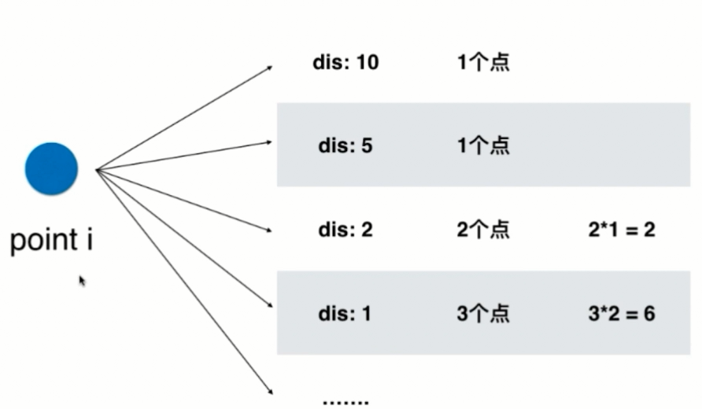

<!-- GFM-TOC -->
* [查找问题](#查找问题)
    * [两类查找问题](#两类查找问题)
        * [查找有无的问题](#查找有无的问题)
            * [349 Intersection of Two Arrays](https://leetcode.com/problems/intersection-of-two-arrays/description/)
            * [242 Valid Anagram](https://leetcode.com/problems/valid-anagram/description/)
            * [202 Happy Number](https://leetcode.com/problems/happy-number/description/)
            * [290 Word Pattern](https://leetcode.com/problems/word-pattern/description/)
            * [205 Isomorphic Strings](https://leetcode.com/problems/isomorphic-strings/description/)
            * [451 Sort Characters By Frequency](https://leetcode.com/problems/sort-characters-by-frequency/description/)
        * [查找对应关系的问题](#查找对应关系的问题)
            * [350 Intersection of Two Arrays II](https://leetcode.com/problems/intersection-of-two-arrays-ii/description/)
            * [1 Two Sum](https://leetcode.com/problems/two-sum/description/)
            * [15 3Sum](https://leetcode.com/problems/3sum/description/)
            * [18 4Sum](https://leetcode.com/problems/4sum/description/)
            * [16 3Sum Closest](https://leetcode.com/problems/3sum-closest/description/)
    * [灵活选择键值](#灵活选择键值)       
        * [454 4Sum II](https://leetcode.com/problems/4sum-ii/description/)
        * [49 Group Anagrams](https://leetcode.com/problems/group-anagrams/description/)
    * [查找表和滑动窗口](#查找表和滑动窗口)
        * [447 Number of Boomerangs](https://leetcode.com/problems/number-of-boomerangs/description/)
        * [149 Max Points on a Line](https://leetcode.com/problems/max-points-on-a-line/description/)
    * [滑动窗口和查找表](#滑动窗口和查找表)
        * [219 Contains Duplicate II](https://leetcode.com/problems/contains-duplicate-ii/description/)
        * [217 Contains Duplicate](https://leetcode.com/problems/contains-duplicate/description/)
        * [220 Contains Duplicate III](https://leetcode.com/problems/contains-duplicate-iii/description/)
<!-- GFM-TOC -->

# 查找问题
## 两类查找问题

* 查找有无

元素‘a’是否存在？set

* 查找对应关系（键值对应）

元素‘a’出现了几次？map

### 查找有无的问题
[349 Intersection of Two Arrays](https://leetcode.com/problems/intersection-of-two-arrays/description/)

* 问题描述： 

给定两个数组nums,求两个数组的公共元素。结果中每个元素只能出现一次，
出现的顺序可以是任意的

* 示例：

nums1=[1,2,2,1],nums2=[2,2]

结果为[2]

* 解题：

要求结果只出现一次，马上要想到set(该集合不允许重复元素)，最终求两个数组的交集，
就是求这两个数组响应的set的交集。

```java
public int[] intersection(int[] nums1, int[] nums2) {
    Set<Integer> set=new HashSet<>();
    for(int i=0;i< nums1.length;i++){
        set.add(nums1[i]);
    }
    Set<Integer> retSet=new HashSet<>();
    for(int i=0;i<nums2.length;i++){
        if(set.contains(nums2[i])){
            retSet.add(nums2[i]);
        }
    }
    int[] retArr=new int[retSet.size()];
    int index=0;
    for(Integer num:retSet){
        retArr[index++]=num;
    }
    return retArr;
}
```
[242 Valid Anagram](https://leetcode.com/problems/valid-anagram/description/)

* 解法一：
```java
public boolean isAnagram1(String s, String t) {
    if(s.length()!=t.length()){
        return false;
    }
    int[] freq=new int[26];
    for(int i=0;i<s.length();i++){
        char c=s.charAt(i);
        freq[c-'a']++;
    }

    for(int i=0;i<s.length();i++){
        char curChar=t.charAt(i);
        if(freq[curChar-'a']==0){
            return false;
        }
        freq[curChar-'a']--;
    }
    return true;
}
```

* 解法二：
```java
public boolean isAnagram(String s, String t) {
     if(s.length()!=t.length()){
         return false;
     }
     //使用map统计 s中字符出啊先的次数
     Map<Character,Integer> map=new HashMap<>();
     for(int i=0;i<s.length();i++){
         char c=s.charAt(i);
         int freq=map.get(s.charAt(i))==null?0:map.get(s.charAt(i));
         map.put(c,++freq);
     }
     for(int i=0;i<t.length();i++){
         char c=t.charAt(i);
         if(map.containsKey(c)){
             int freq=map.get(c);
             map.put(c,--freq);
         }else{
             return false;
         }
     }
     for(int i=0;i<s.length();i++){
         if(map.get(s.charAt(i))!=0){
             return false;
         }
     }
     return true;
 }
```

[202 Happy Number](https://leetcode.com/problems/happy-number/description/)
```java
//计算产生的中间数
public int getNumber(int n){
    int sum=0;
    while(n>0){
        sum+=(n%10)*(n%10);
        n/=10;
    }
    return sum;
}

public boolean isHappy(int n) {
    Set<Integer> set=new HashSet<>();
    //set存储运算过程中的数字（不重复）
    while(n!=1){
        if(set.contains(n)){
            //说明运算过程中出现重复元素，则肯定不是幸运数字
            return false;
        }else{
            set.add(n);
            n=getNumber(n);
        }
    }
    return true;
}
```

[290 Word Pattern](https://leetcode.com/problems/word-pattern/description/)
```java
//时间复杂度：O(n)
//空间富足度：O(1)
public boolean wordPattern(String pattern, String str) {
    //维护一个hash表，key为pattern中的字符，value为被切割的字符串
    Map<Character,String> map=new HashMap<>();
    //题目要求str是非空的
    String[] strs=null;
    if(str!=null){
        strs = str.split(" ");
    }
    if(pattern.length() != strs.length)
        return false;

    for(int i=0;i<pattern.length();i++){
        char c=pattern.charAt(i);
        if(map.containsKey(c)){
            String v=map.get(c);
            if(!v.equals(strs[i])){
                return false;
            }
        }else{
            if(map.containsValue(strs[i]))
                return false;
            map.put(c,strs[i]);
        }
    }
    return true;
}
```

[205 Isomorphic Strings](https://leetcode.com/problems/isomorphic-strings/description/)
```java
//时间复杂度：O(n)
//空间富足度：O(1)
public boolean isIsomorphic(String s, String t) {
    Map<Character,Character> map=new HashMap<Character,Character>();
    for(int i=0;i<s.length();i++){
        if(map.containsKey(s.charAt(i))){
            char c=t.charAt(i);
            if(c!=map.get(s.charAt(i))){
                return false;
            }
        }else{
            if(map.containsValue(t.charAt(i))){
                return false;
            }
            map.put(s.charAt(i),t.charAt(i));
        }
    }
    return true;
}
```

[451 Sort Characters By Frequency](https://leetcode.com/problems/sort-characters-by-frequency/description/)
```java
public String frequencySort(String s) {
    //map存储字符及其出现的频率
    Map<Character,Integer> map=new HashMap<>();

    for(int i=0;i<s.length();i++){
        int freq=map.get(s.charAt(i))==null?0:map.get(s.charAt(i));
        map.put(s.charAt(i),++freq);
    }

    //通过优先队列对map按照值进行降序排序（优先队列默认是升序）
    PriorityQueue<Map.Entry<Character,Integer>> priorityQueue=
            new PriorityQueue<>(new Comparator<Map.Entry<Character, Integer>>() {
        @Override
        public int compare(Map.Entry<Character, Integer> o1, Map.Entry<Character, Integer> o2) {
            return o2.getValue()-o1.getValue();
        }
    });
    priorityQueue.addAll(map.entrySet());

    StringBuilder builder=new StringBuilder();
    while(!priorityQueue.isEmpty()){
        Map.Entry<Character,Integer> e=priorityQueue.poll();
        for(int i=0;i<e.getValue();i++){
            builder.append(e.getKey());
        }
    }
    return builder.toString();
}
```
### 查找对应关系的问题
[350 Intersection of Two Arrays II](https://leetcode.com/problems/intersection-of-two-arrays-ii/description/)

* 问题描述：

给定两个数组nums,求两个数组的交集。

* 示例：

nums1=[1,2,2,1],num2=[2,2]

结果为[2,2]

出现的顺序是任意的

* 解题：
```java

public int[] intersect(int[] nums1, int[] nums2) {
    Map<Integer,Integer> map=new HashMap<>();
    //map记录元素出现的次数
    for(int i=0;i<nums1.length;i++){
        Integer value=map.get(nums1[i]);
        value=(value==null?1:value+1);
        map.put(nums1[i],value);
    }

    List<Integer> list=new ArrayList<>();
    for (int j = 0; j < nums2.length; j++) {
        int c=map.get(nums2[j])==null?0:map.get(nums2[j]);
        //c=0，说明nums2[j]不是公共元素
        if(c>0){
            list.add(nums2[j]);
            map.put(nums2[j],map.get(nums2[j])-1);
            //map对应的键值频率要减1，相当于从nums1[]数组中取出一个值为nums2[j]的元素
        }
    }

    int[] result = new int[list.size()];
    for (int k = 0; k < list.size(); k++) {
        result[k] = list.get(k);
    }
    return result;
}
```

[1 Two Sum](https://leetcode.com/problems/two-sum/description/)

* 问题描述：

给定一个整型数组nums。返回这个数组中的索引值i和j,
使得nums[i]+nums[j]等于一个给定的target值。两个索引不相等。

* 示例：

nums[2,7,11,15],target=9

返回[0,1]

* 解题：

1、确定问题：

**索引是从0开始还是从1开始**？从0开始

**没有解怎么办**？一定有解

**多个解怎么办**？保证有唯一解

2、解题思路：

查找表问题。将所有元素加入查找表，之后对于每一个元素a,查找target-a是否存在。

这里要用到HashMap<Intager,Integer>,键存储的是该元素的值，值存储的是该元素的下标，

有可能存在相同的元素，则键值相同，会发生值覆盖问题。

遍历nums的数组，

下标在[0,i)元素已经在查找表中，判断target-nums[i]，是否在查找表中：

如果存在，返回结果

如果不存在，将nums[i]加入查找表中

```java
public int[] twoSum(int[] nums, int target) {
    if(nums.length<=1){
        return null;
    }
    Map<Integer,Integer> map=new HashMap<>();
    //HashMap<Intager,Integer>,键存储的是该元素的值，值存储的是该元素的下标.
    for(int i=0;i<nums.length;i++){
        int v=target-nums[i];
        //在看查找表中查找是否有 target-nums[i]元素
        if(map.containsKey(v)){
            return new int[]{i,map.get(v)};
        }
        map.put(nums[i],i);
    }
    return null;
}
```

[15 3Sum](https://leetcode.com/problems/3sum/description/)

* 问题描述：

给定一个整型数组，寻找其中的所有不同的三元组(a,b,c),使得a+b+c=0;

* 示例：

nums=[-1,0,1,2,-1,-4]

结果为[[-1,0,1],[-1,-1,2]]

* 解题：

1、确定问题：

**不同的三元组**？三元组的元素互不相同

**如果有多个解，解的顺序**？顺序是任意的

**如果没有解**？一定有解

2、思路：
```java
public List<List<Integer>> threeSum(int[] nums) {
    List<List<Integer>> ret=new ArrayList<>();
    if(nums.length<3){
        return ret;
    }
    Map<Integer,Integer> map=new HashMap<>();
    //HashMap<Intager,Integer>,键存储的是该元素的值，值存储的是该元素出现的次数
    for(int num:nums){
        int freq=map.get(num)==null?0:map.get(num);
        map.put(num,++freq);
    }
    Set<Integer> keySet=map.keySet();
    for(Integer num:keySet){
        //num 表示数组中的元素值
        //numCount为该元素出现的次数
        int numCount=map.get(num);

        //三个相同元素相加的情况
        if(numCount>=3){
             //num元素出现3次以上的，用该元素值相加和为0,只能是0了。
            if(num==0){
                ret.add(Arrays.asList(0,0,0));
            }
        }

        //两个相同元素和另外一个元素相加的情况
        if(numCount>=2){
            //num元素出现次数为2,用该元素之和另外一个元素和为0，
            int target=0-2*num;
            if(map.containsKey(target) && target!=0){
                //如果map中存在target值，则说明（num，num,target）是一组解
                //target如果是0,那么就变成了（0,0,0）三个相同元素之和了
                ret.add(Arrays.asList(num,num,target));
            }
        }

        //三个不同元素相加的情况
        for(Integer num2:keySet){
            int num3=0-num-num2;
            //假设 [num,num2,num3]是有序的并且num<num2<num3
            if(num>=num2 || num2>=num3 || map.get(num3)==null){
                continue;
            }
            ret.add(Arrays.asList(num,num2,num3));
        }
    }
    return ret;
}
```

[18 4Sum](https://leetcode.com/problems/4sum/description/)

* 问题描述：

给定一个整型数组，寻找其中的所有不同的四元组（a,b,c,d）,是的a+b+c+d等于一个给定的数字target.

* 示例：

nums=[1,0,-1,0,-2,2],target=0

结果为：[[-1,0,0,1],[-2,-1,1,2],[-2,0,0,2]]

* 解题：

[16 3Sum Closest](https://leetcode.com/problems/3sum-closest/description/)

* 问题描述：

给定一盒整型数组，寻找其中的三个元素 a,b,c,使得a+b+c的值最接近另外一个给定的数字target

* 示例：

nums=[-1,2,1,-4],target=1

结果为2(-1+2+1=2)

* 解题：

## 灵活选择键值

[454 4Sum II](https://leetcode.com/problems/4sum-ii/description/)

* 问题：

给出四个整型数组A,B，C,D，寻找有多少i,j,k,l的组合，使得
A[i]+B[j]+C[k]=D[l]==0.其中A,B,C，D均含有相同的元素个数N,且0<=N<=500。

* 解题：
```java
//将C+D的每一种可能放入查找表中：时间复杂度:O（n^2）
public int fourSumCount(int[] A, int[] B, int[] C, int[] D) {
    Map<Integer,Integer> map=new HashMap<>();
    //<C[i]+D[j],出现的次数>
    for(int i=0;i<C.length;i++){
        for(int j=0;j<D.length;j++){
            int freq=map.get(C[i]+D[j])==null?0:map.get(C[i]+D[j]);
            map.put(C[i]+D[j],++freq);
        }
    }

    int res=0;
    //记录解的个数
    for(int i=0;i<A.length;i++){
        for(int j=0;j<B.length;j++){
            if(map.containsKey(-A[i]-B[j])){
                res+=map.get(-A[i]-B[j]);
            }
        }
    }
    return res;
}
```
时间复杂度：O(n^2)

空间复杂度：O(n^2)

[49 Group Anagrams](https://leetcode.com/problems/group-anagrams/description/)

## 查找表和滑动窗口
* [447 Number of Boomerangs](https://leetcode.com/problems/number-of-boomerangs/description/)

* 问题：

给出一个平面上的n个点，寻找存在多少个由这些点构成的三元组(i.j.k),
使得i,j两点的距离等于i，k两点的距离，其中n最多为500，且所有点坐标的范围在
[-10000,10000]之间。

* 解题：

1、确定问题：

**n<=500,时间复杂度**? 最差要有O(n^2)

**坐标范围[-10000,10000]之间能不能使用int类型**？ (-10000)^2+10000^2=2*10^8 在int范围内，
可以使用int类型

2、思路：

(i,j)和(i,k)的距离相等，则i是一个“枢纽”，对于每个点i,遍历其余点到i的距离。
准备一个查找表其他点到点i的距离：

如果到点i的距离相等的点<2,返回0

如果到点i的距离相等的点>=2（假设为n）,则有n*(n-1)种可能

<div align="center"></div>

```java
public int numberOfBoomerangs(int[][] points) {
    //points 表示 [[0,0],[1,0],[2,0]],实际上就是 points[points.length][2]
    int res=0;
    //存储返回的结果
    for(int i=0;i<points.length;i++){
        Map<Integer,Integer> map=new HashMap<Integer,Integer>();
        //距离到i距离相同的点出现的次数
        for(int j=0;j<points.length;j++){
            if(j!=i){
                int freq=map.get(distance(points,i,j))==null?0:map.get(distance(points,i,j));
                map.put(distance(points,i,j),++freq);
            }
        }

        //遍历map,如果到点i的距离相等的点>=2（假设为n）,则有n*(n-1)种可能
        Set<Integer> set=map.keySet();
        for(Integer key:set){
            int value=map.get(key);
            if(value>=2){
                res+=value*(value-1);
            }
        }
    }
    return res;
}

//计算点i到点j的距离
public int distance(int[][] points,int i,int j){
    return (points[i][0]-points[j][0])*(points[i][0]-points[j][0])+
            (points[i][1]-points[j][1])*(points[i][1]-points[j][1]);
}
```
[149 Max Points on a Line](https://leetcode.com/problems/max-points-on-a-line/description/)

* 解题：

1、确定问题：

**如果存在相同点如何处理**？包含在计算中

2、思路：
给定任意多个点，找到在一条线上最多的点。
都知道两点构成一条直线，如果要求另一点也在这条直线上，那个这个点跟其中任何一个点的斜率必须要求一致。
针对每个点，可以找到其他点跟它组成的直线中点最多的,跟它组成的直线，斜率一样的一定在一条直线上。
我们考虑对每个点，建一条斜率与点数的对应的查找表

```java
public int maxPoints(Point[] points) {
    if(points==null || points.length==0){
        return 0;
    }
    if(points.length==1){
        return 1;
    }
    int ret=0;
    for(int i=0;i<points.length;i++){
        Map<Double,Integer> map=new HashMap<Double, Integer>();
        //map存储的是斜率与点出现的频率
        int same=1;
        //记录出现相同的点的个数
        for(int j=0;j<points.length;j++){
            if(i==j){
                continue;
            }
            //先看看是否有相同点
            if(isSamePoint(points[i],points[j])){
                same++;
                continue;
            }else{
                double slope=getSlope(points[i],points[j]);
                int freq=map.getOrDefault(slope,0)+1;
                map.put(slope,freq);
            }
        }
        if(map.size()==0){
            //只有相同点的极端情况
            ret=Math.max(ret,same);
        }else {
            for (Double slope : map.keySet()) {
                ret = Math.max(ret,map.get(slope)+same);
                if(slope>=0.9999999894638303){
                    ret-=1;
                }
            }
        }
    }
    return ret;
}
```

## 滑动窗口和查找表
[219 Contains Duplicate II](https://leetcode.com/problems/contains-duplicate-ii/description/)

* 问题：

给出一个整型数组nums和一个整数k,是否存在索引i和j,使得nums[i]==nums[j]并且i和j之间的差不超过k
 
* 示例：

nums = [1,2,3,1], k = 3

返回的结果:true

* 解题：

滑动窗口和查找表的综合使用，维持一个长度为k的滑动窗口，只要在该窗口查找是否有两个相等的元素。
窗口不断向前滑行。
```java
public boolean containsNearbyDuplicate(int[] nums, int k) {
    Set<Integer> set=new HashSet<>();
    //set存储的是滑动窗口中的元素
    for(int i=0;i<nums.length;i++){
        if(set.contains(nums[i])){
            return true;
        }
        set.add(nums[i]);
        //维持滑动窗口的大小为k
        if(set.size()==k+1){
            set.remove(nums[i-k]);
        }
    }
    return false;
}
```
时间复杂度：O(n)

空间复杂度：O(k)

[217 Contains Duplicate](https://leetcode.com/problems/contains-duplicate/description/)
```java
public boolean containsDuplicate(int[] nums) {
    Set<Integer> set=new HashSet<>();
    for(int i=0;i<nums.length;i++){
        if(set.contains(nums[i])){
            return true;
        }
        set.add(nums[i]);
    }
    return false;
}
```
时间复杂度：O(n)

空间复杂度：O(n)

[220 Contains Duplicate III](https://leetcode.com/problems/contains-duplicate-iii/description/)

* 问题：
给出一个整型数组nums,是否存在索引i和j，使得nums[i]和nums[j]之间的差别不超多给定的整数t,

且i和j之间的差别不超过给定的整数k.

* 解题：

1、确定问题

**t可以小于0**？t可以小于0的，但是这里两数字差绝对值，要求t>=0

**k可以小于1**？k可以小于1，但是k<1就没有意义了。

关键是判断条件： 对于|nums[i]-nums[j]|<=t ,有nums[i]-t<=nums[j]<=nums[i]+t,t>=0
```java
public boolean containsNearbyAlmostDuplicate(int[] nums, int k, int t) {
    if (k < 1 || t < 0)
        return false;
    SortedSet<Long> set=new TreeSet<>();
    //采用Long类型是为了防止整型溢出
    for(int i=0;i<nums.length;i++){
        //判断是否存在元素在 [nums[i]-t,nums[i]+t]之间
        Set<Long> s = set.subSet((long) nums[i] - t, (long) nums[i] + t + 1);
        //左闭右开，所以 nums[i]+t要+1
        //s存储[nums[i]-t,nums[i]+t]之间的元素
        if(!s.isEmpty()){
            return true;
        }
        set.add((long)nums[i]);
        if(set.size()==k+1){
            set.remove((long)nums[i-k]);
        }
    }
    return false;
}
```