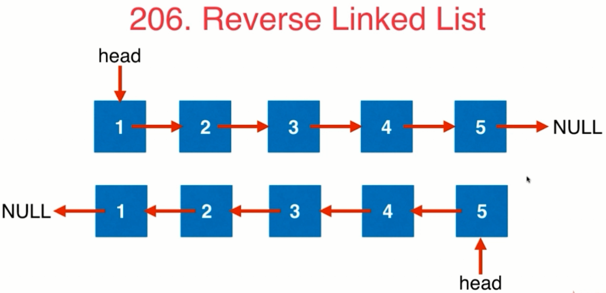
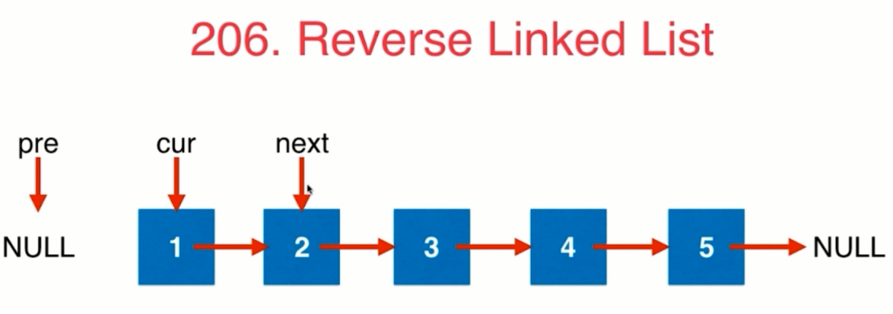
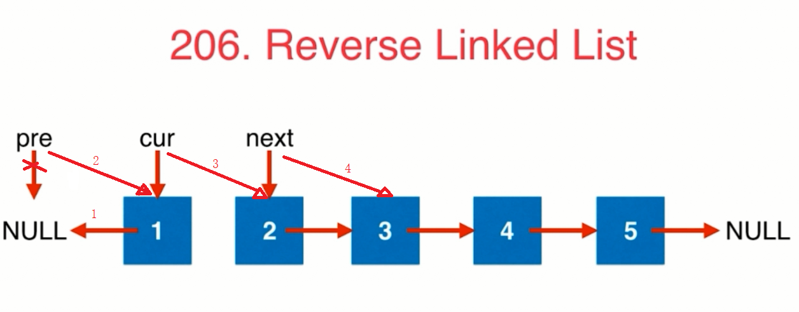
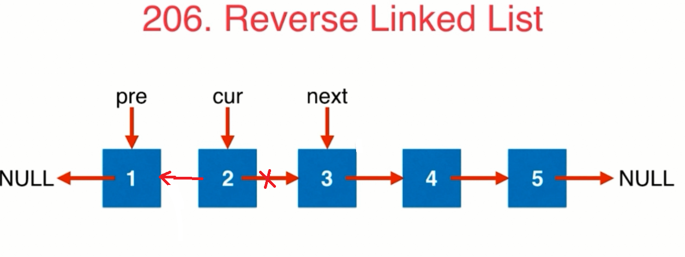
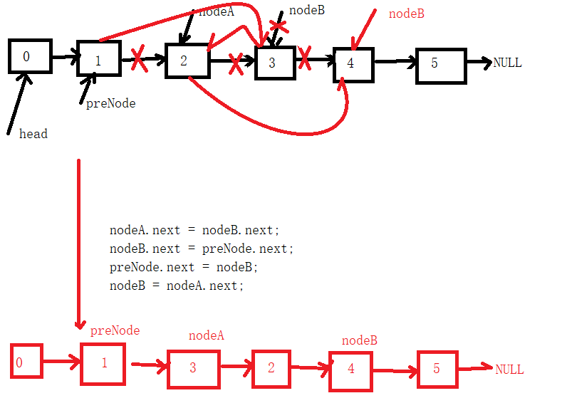
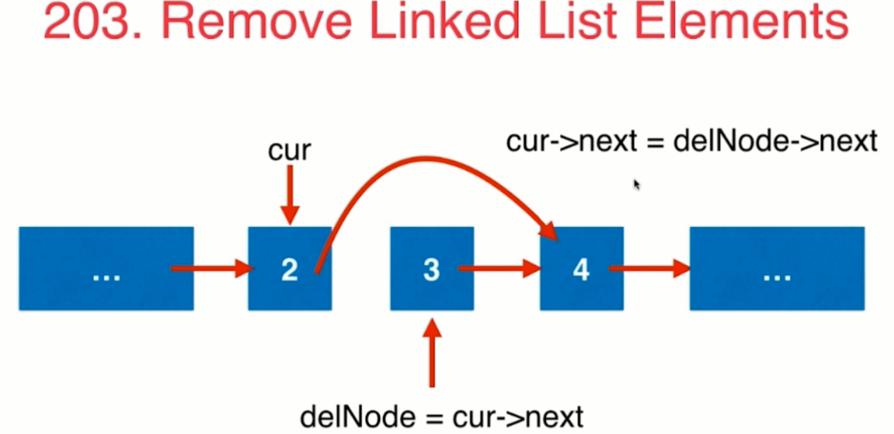
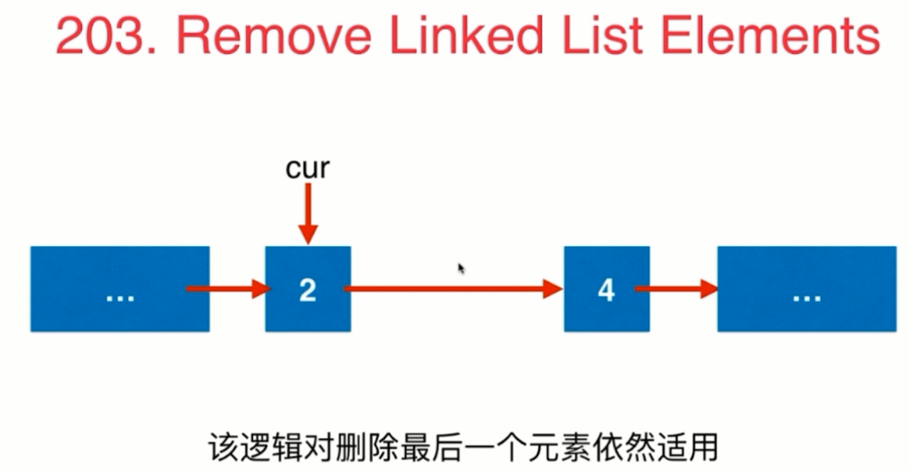
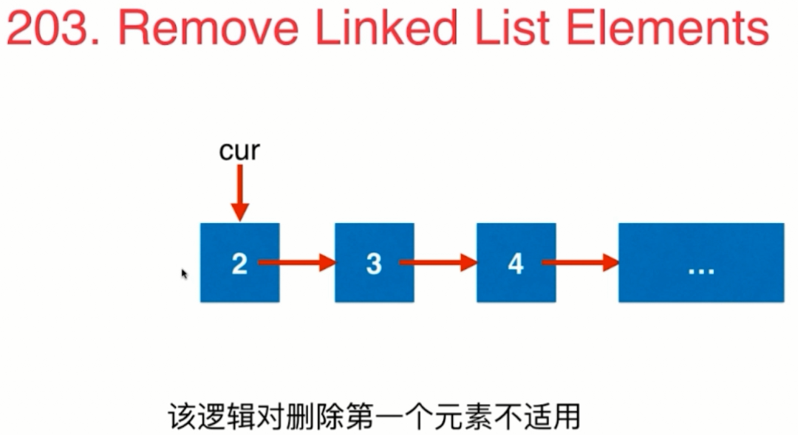
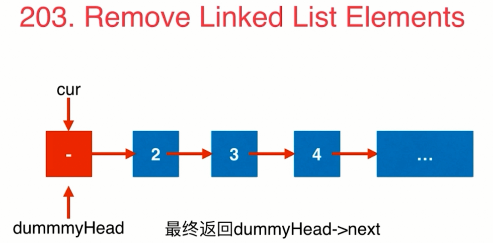

<!-- GFM-TOC -->
* [链表问题](#链表问题)
    * [牛刀小试](#牛刀小试)
        * [206 Reverse Linked List](https://leetcode.com/problems/reverse-linked-list/description/)
        * [92 Reverse Linked List II](https://leetcode.com/problems/reverse-linked-list-ii/description/)
        * [83 Remove Duplicates from Sorted List](https://leetcode.com/problems/remove-duplicates-from-sorted-list/description/)
        * [86 Partition List](https://leetcode.com/problems/partition-list/description/)
        * [328 Odd Even Linked List](https://leetcode.com/problems/odd-even-linked-list/description/)
        * [2 Add Two Numbers](https://leetcode.com/problems/add-two-numbers/description/)
        * [445 Add Two Numbers II](https://leetcode.com/problems/add-two-numbers-ii/description/)
    * [设立链表的虚拟头结点](#设立链表的虚拟头结点)
        * [203 Remove Linked List Elements](https://leetcode.com/problems/remove-linked-list-elements/description/)
        * [82 Remove Duplicates from Sorted List II](https://leetcode.com/problems/remove-duplicates-from-sorted-list-ii/description/)
<!-- GFM-TOC -->

# 链表问题
## 牛刀小试
[206 Reverse Linked List](https://leetcode.com/problems/reverse-linked-list/description/)

* 问题描述：

<div align="center"></div>

* 解题：

<div align="center"></div>
<div align="center"></div>
<div align="center"></div>

非递归方式：
```java
public ListNode reverseList1(ListNode head) {
    ListNode pre=null;
    ListNode cur=head;

    while(cur!=null){
        ListNode next=cur.next;
        cur.next=pre;
        pre=cur;
        cur=next;
    }
    return pre;
}
```
递归方式：
```java
public ListNode reverseList(ListNode head) {
    if(head==null || head.next==null){
        return head;
    }

    ListNode next=head.next;
    head.next=null;
    ListNode newNode=reverseList(next);
    next.next=head;
    return newNode;
}
```


[92 Reverse Linked List II](https://leetcode.com/problems/reverse-linked-list-ii/description/)

* 解题：

<div align="center"></div>

```java
public ListNode reverseBetween(ListNode head, int m, int n) {
    if(m>=n){
        return head;
    }
    if(head==null || head.next==null){
        return head;
    }

    ListNode newHead=new ListNode(0);
    newHead.next=head;
    head=newHead;
    ListNode preNode=head;
    //保存的是指向m位置的前一个节点，也就是(m-1)位置
    for(int i=0;i<m-1;i++){
        preNode=preNode.next;
    }
    ListNode nodeA = preNode.next;
    ListNode nodeB = preNode.next.next;
    //cur此时是当前要翻转的节点
    for(int i=0;i<n-m;i++){
        nodeA.next=nodeB.next;
        nodeB.next=preNode.next;
        preNode.next=nodeB;
        nodeB=nodeA.next;
    }
    return head.next;
}
```

[83 Remove Duplicates from Sorted List](https://leetcode.com/problems/remove-duplicates-from-sorted-list/description/)

[86 Partition List](https://leetcode.com/problems/partition-list/description/)

[328 Odd Even Linked List](https://leetcode.com/problems/odd-even-linked-list/description/)

[2 Add Two Numbers](https://leetcode.com/problems/add-two-numbers/description/)

[445 Add Two Numbers II](https://leetcode.com/problems/add-two-numbers-ii/description/)
        
## 设立链表的虚拟头结点
[203 Remove Linked List Elements](https://leetcode.com/problems/remove-linked-list-elements/description/)

* 问题：

在链表中删除数值为val的所有节点

* 示例：

1->2->6->3->4->5->6->NULL,删除值为6的节点

返回 1->2->3->4->5->NULl

* 解题：

<div align="center"></div>
<div align="center"></div>
<div align="center"></div>
<div align="center"></div>

```java
public ListNode removeElements(ListNode head, int val) {
    if(head==null){
        return head;
    }
    //创建一个虚拟的头结点
    ListNode dummyHead=new ListNode(0);
    dummyHead.next=head;

    ListNode cur=dummyHead;
    while(cur.next!=null){
        //cur指向被删除元素的前一个元素,cur.next就是要删除的元素
        if(cur.next.val==val){
            ListNode delNode=cur.next;
            cur.next=delNode.next;
            //删除该节点，直接赋值为null,让JVM进行垃圾回收就行了
            delNode.next=null;
        }else{
            cur=cur.next;
        }
    }

    ListNode retNode=dummyHead.next;
    dummyHead.next=null;
    return retNode;
}
```

[82 Remove Duplicates from Sorted List II](https://leetcode.com/problems/remove-duplicates-from-sorted-list-ii/description/)
